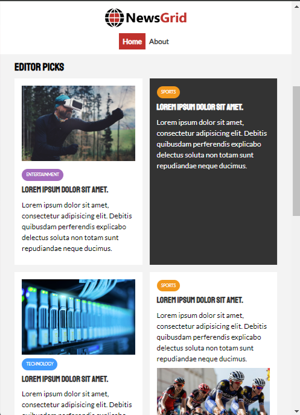

# NewsGrid

Welcome to NewsGrid! This project showcases advanced use of CSS Grid through a news website built solely with HTML and CSS.


## Description

NewsGrid is a news website designed to demonstrate a deep understanding of CSS Grid. The site features a modern layout that adapts to various screen sizes, highlighting the power and flexibility of CSS Grid for creating complex web layouts.

## Features

- **Responsive Design:** The layout adjusts seamlessly across different screen sizes, ensuring a great user experience on both desktop and mobile devices.
- **Clean and Modern UI:** Aesthetic design focusing on readability and user engagement.
- **CSS Grid Mastery:** Extensive use of CSS Grid to create a sophisticated and versatile layout.

## Installation

To get a local copy up and running, follow these simple steps:

1. **Clone the repository:**
   ```bash
   git clone https://github.com/yourusername/NewsGrid.git


## Screenshots



